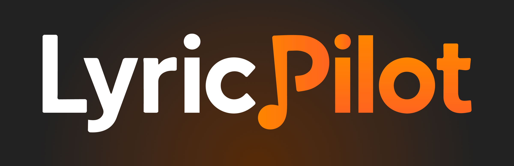
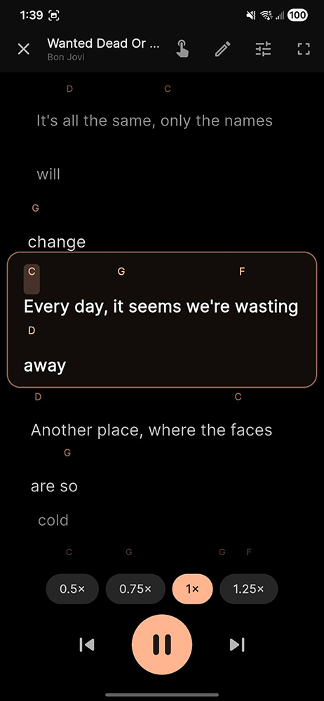
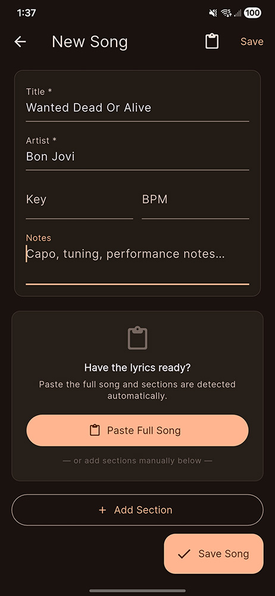
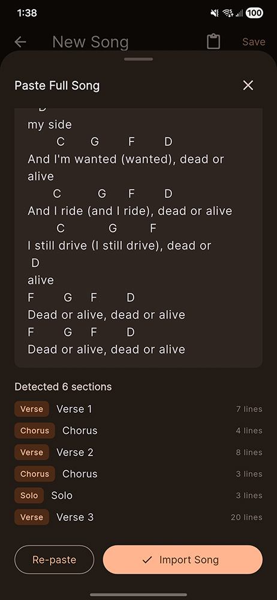
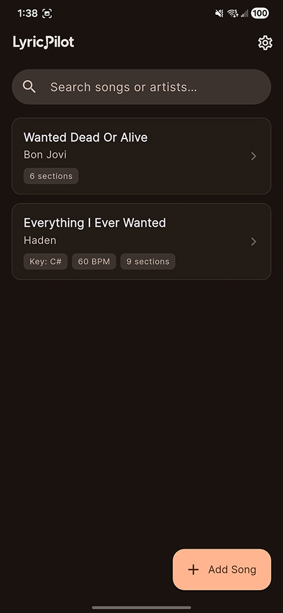
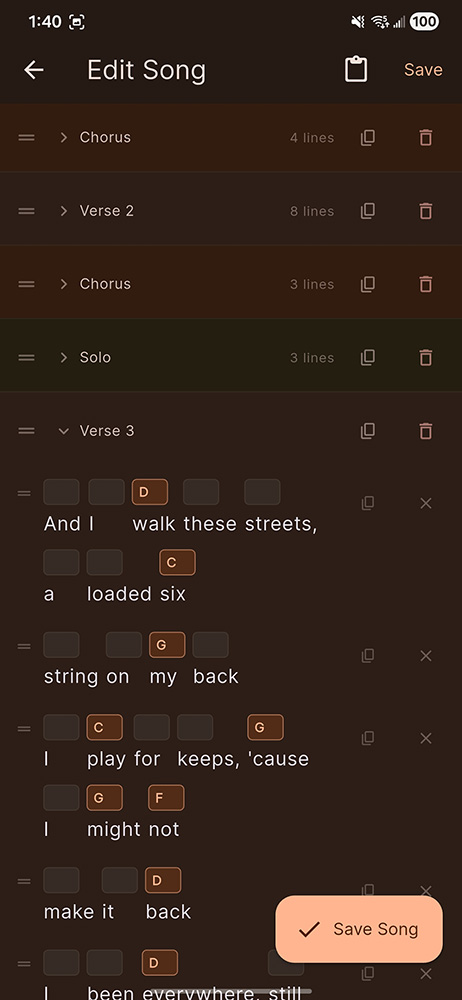

# LyricPilot

**Like karaoke but with chords.** Best for casual guitar players or other hobby musicians.

## What it does

- **Displays lyrics and chords in sync**, like a teleprompter for musicians
- **Help you internalize songs** through repetition and progressive independence
- **Practice at your own tempo** with adjustable speed controls
- **Loop tricky sections** until muscle memory kicks in

**The goal:** Build real mastery through structured practice so you can eventually play without looking at your screen at all.

## Download

**Latest Version:** [LyricPilot.apk](releases/LyricPilot.apk) (~55 MB)

### Install Instructions

1. Download the APK file
2. Enable "Install from unknown sources" in your Android settings if prompted
3. Open the downloaded file to install

Alternatively, download from [itch.io](https://hadenhiles.itch.io/lyric-pilot)

## Screenshots

View Screenshots

 

<table>
  <tr>
    <td></td>
    <td></td>
    <td></td>
  </tr>
  <tr>
    <td></td>
    <td></td>
    <td></td>
  </tr>
</table>

## Development

This is a Flutter application for Android.

### Getting Started with Development

If you want to build from source:

1. Install [Flutter](https://docs.flutter.dev/get-started/install)
2. Clone this repository
3. Run `flutter pub get` to install dependencies
4. Run `flutter run` to launch in development mode
5. Run `flutter build apk` to build a release APK

For more information on Flutter development:
- [Flutter Documentation](https://docs.flutter.dev/)
- [Flutter Cookbook](https://docs.flutter.dev/cookbook)

## License

This project is licensed under the MIT License - see the [LICENSE](LICENSE) file for details.
